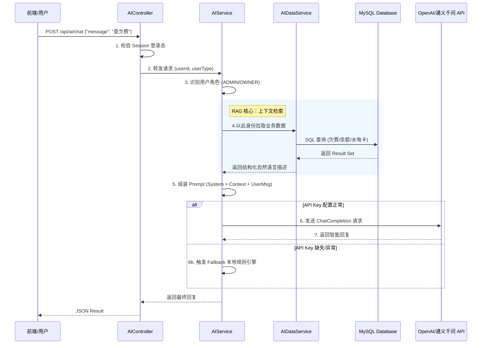

# 智能物业管理系统 - AI 模块调用逻辑深度解析

> 生成日期: 2026-01-16
> 模块: AI 智能管家 (RAG 架构)

本项目采用 **RAG (检索增强生成)** 架构，将传统的物业管理业务数据与大语言模型（LLM）深度融合。核心不仅仅是调用 API，而是构建了一个具备“业务感知”能力的智能中枢。

## 1. 核心架构设计

整个 AI 模块由四个核心组件构成，遵循 **MVC + Service** 分层架构：

- **Config Layer (`AIConfig`)**: 负责基础设施连接与适配。
- **Controller Layer (`AIController`)**: 负责安全网关与鉴权。
- **Service Layer (`AIService`)**: 负责对话流程编排与 Prompt 工程。
- **Data Layer (`AIDataService`)**: **(核心)** 负责实时提取业务数据并转化为自然语言上下文。

### 调用全链路逻辑图

---

## 2. 详细模块实现逻辑

### 2.1 配置层 (`AIConfig.java`)
**职责：** 建立与大模型的连接通道，并提供**自动降级**能力。
- **适配性：** 使用 `OpenAIClient` 标准 SDK，通过配置 `baseUrl` 可无缝切换阿里云通义千问、DeepSeek 等国产模型。
- **健壮性：** 启动时检测环境变量 `OPENAI_API_KEY`。若未配置，`openAIClient` Bean 初始化为 `null`，系统自动进入“离线演示模式”，防止应用启动失败。

### 2.2 控制层 (`AIController.java`)
**职责：** 安全守门员。
- **身份锚点：** 严禁信任前端传递的 `userId`。所有业务操作必须基于 `session.getAttribute("user")` 提取的身份，杜绝越权访问（如 A 业主查询 B 业主的账单）。
- **流量防护：** 限制输入文本长度（1000字符），防止 Prompt 注入或 Token 耗尽攻击。

### 2.3 数据层 (`AIDataService.java`) —— RAG 的灵魂
**职责：** 将冷冰冰的数据库字段“翻译”给 AI 听。
- **多维聚合：**
    - **业主视图：** 聚合 `FeeDAO`（欠费单）、`UserWalletDAO`（钱包余额）、`UtilityCardDAO`（水电剩余字数）。
    - **管理员视图：** 聚合全局统计（总欠费额）、收费率趋势、高风险楼栋 TOP5。
- **隐私边界：** 代码级强制隔离。`getUserArrears` 方法内部校验 `requestUserId`，确保数据不出域。

### 2.4 服务层 (`AIService.java`)
**职责：** 对话编排与策略选择。
- **动态人设 (System Prompt)：**
    - **OWNER 模式：** 设定为“贴心管家”，语气温柔，重点在引导缴费和报修。
    - **ADMIN 模式：** 设定为“数据分析师”，语气专业，重点在风险提示和运营建议。
- **上下文注入 (Context Injection)：** 将 `AIDataService` 返回的数据拼接到 Prompt 中：
    > "【当前用户实时数据】您有 2 笔物业费未缴，共计 500 元..."
    这使得 AI 不是在瞎聊，而是基于事实进行回复。
- **兜底机制 (Fallback)：** 当 `openAIClient` 为 `null` 或网络超时时，捕获异常并调用 `fallbackChat()`。该方法通过关键词匹配（如包含“欠费”、“缴费”）返回预设的静态话术，保证服务高可用。

## 3. 总结
本项目实现的是一个 **"业务感知型"** AI 系统。它不依赖大模型的内部知识库，而是通过 **Function Calling / RAG** 的思想，让大模型拥有了“查账”、“看房”的能力，同时严格遵守了企业级的**权限控制**和**隐私保护**标准。
