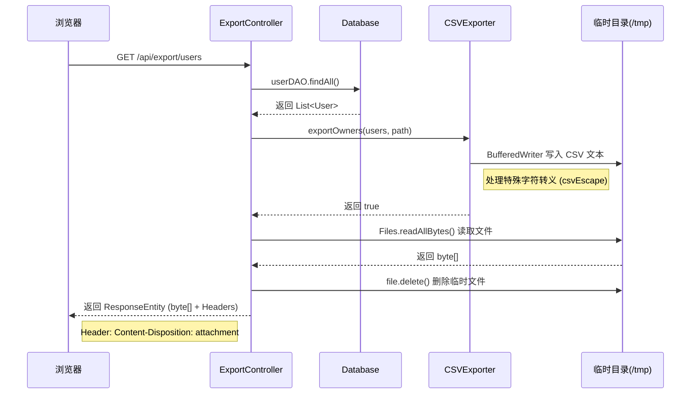

# CSV 导出功能定向解析

> 生成日期: 2026-01-16
> 模块: ExportController & CSVExporter

本功能实现了从数据库查询数据到浏览器下载 CSV 文件的全链路流程，重点在于 **Web I/O 处理** 和 **CSV 格式转义**。

## 1. 核心流程图



## 2. 关键代码解析

### 2.1 控制层 (`ExportController.java`)
**设计模式：** 临时文件中转模式。
- **优点：** 职责分离，工具类不依赖 HTTP 环境。
- **流程：**
    1.  **数据获取：** 调用 DAO 拿到全量数据。
    2.  **路径生成：** 使用 `System.getProperty("java.io.tmpdir")` 获取系统临时目录，确保跨平台（Windows/Linux）兼容性。
    3.  **响应封装：**
        -   `Content-Type: text/csv; charset=UTF-8`: 声明文件类型。
        -   `Content-Disposition: attachment`: **核心**，强制浏览器触发下载行为。

### 2.2 工具类 (`CSVExporter.java`)
**设计模式：** 静态工具方法 (Static Utility)。
- **核心逻辑：** 遍历 List，拼接字符串，写入 BufferWriter。
- **转义处理 (`csvEscape`)：** **(答辩亮点)**
    -   CSV 是逗号分隔文件，如果内容本身包含逗号（如地址），必须用双引号包裹。
    -   如果内容包含双引号，必须替换为两个双引号 (`""`) 进行转义。
    -   *代码对应：*
        ```java
        if (value.contains(",") || value.contains("\"") || value.contains("\n")) {
            return "\"" + value.replace("\"", "\"\"") + "\"";
        }
        ```

## 3. 面试/答辩高频 Q&A

**Q: 为什么生成的 CSV 在 Excel 里打开可能是乱码？**
**A:** Excel 默认可能不按照 UTF-8 读取。虽然我在 Header 里设置了 charset，但最稳妥的方法是在文件头部写入 3 字节的 **BOM (Byte Order Mark)**。目前方案是标准的 Web 下载方案。

**Q: 如果数据量有 100 万条，你现在的写法有什么问题？**
**A:** 我现在是先生成文件再读取为 `byte[]`，这会把整个文件加载进内存，可能导致 **OOM (内存溢出)**。
**优化方案：** 应该使用 `response.getOutputStream()`，配合 `BufferedWriter` 边查边写（流式输出），不再经过临时文件和内存数组。

**Q: 为什么用 `BufferedWriter`？**
**A:** 它是带缓冲区的字符流，能减少磁盘 I/O 次数，提高写入性能。

## 4. 总结
该功能展示了对 **HTTP 协议头**、**Java IO 流** 以及 **数据格式规范** 的综合运用能力。虽然代码量不大，但细节处理（如转义、临时文件清理）体现了代码的健壮性。
