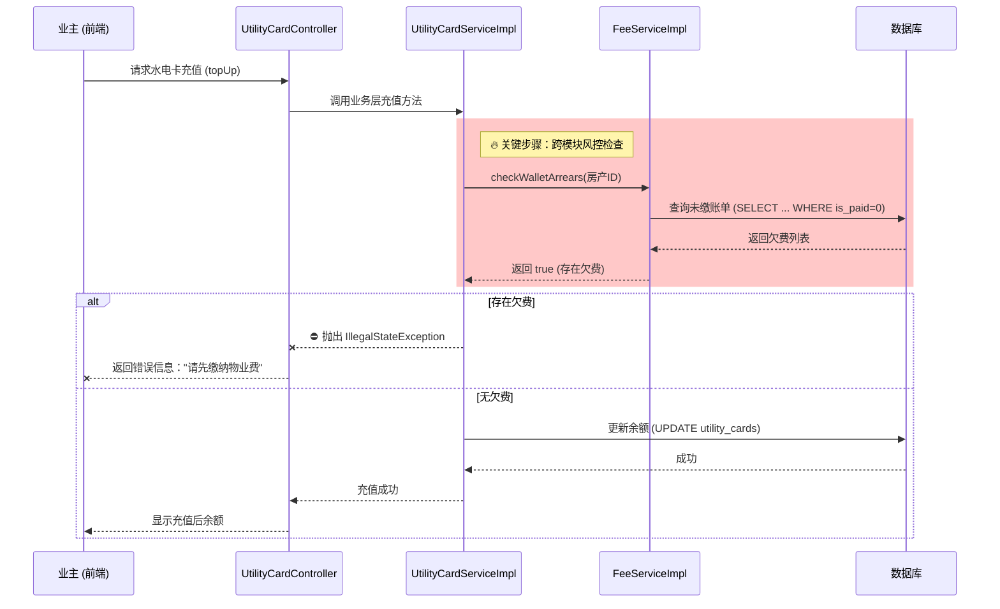

# 🛡️ 核心业务拦截机制深度解析 - “欠费熔断”策略

> **💡 答辩高光时刻**
> 如果评委问：**“你的系统只是简单的增删改查吗？有什么体现业务思考的设计？”**
> 请立刻拿出这份文档的内容，这是你项目中**最有价值的业务逻辑设计**。

---

## 1. 业务背景与设计思想

**痛点**：在现实物业管理中，**物业费收缴难**是最大的痛点。很多业主只交水电费（因为没水没电没法生活），但故意拖欠物业费。

**解决方案**：**“刚需倒逼策略”**。
我设计了一套**“欠费熔断机制”**：将“水电充值”（刚需服务）与“物业费缴纳”（非刚需服务）进行强绑定。
*   **规则**：当系统检测到业主名下存在逾期未缴的物业费或取暖费时，**强制锁定**其水电卡充值功能。
*   **目的**：通过技术手段辅助管理，倒逼业主在充值水电前，必须先结清历史欠款。

---

## 2. 核心代码透视

这个逻辑并不在数据库约束中，而是在 **Service 层（业务逻辑层）** 通过跨模块调用实现的。

**关键文件**：`UtilityCardServiceImpl.java`

```java
@Service
public class UtilityCardServiceImpl implements UtilityCardService {

    @Autowired
    private FeeService feeService; // 注入费用服务，用于跨模块检查

    @Override
    @Transactional(rollbackFor = Exception.class)
    public boolean topUp(Long cardId, Double amount) {

        // 1. 基础校验：查卡是否存在...
        UtilityCard card = utilityCardDAO.findById(cardId);

        // 🔥【核心拦截点】🔥
        // 调用 FeeService 检查该房产是否有未缴的“钱包类费用”（即物业费/取暖费）
        // checkWalletArrears 方法会遍历该房产下的账单，看是否有 status=0 且 type=WALLET 的记录
        boolean hasArrears = feeService.checkWalletArrears(card.getpId());

        if (hasArrears) {
            // ⛔️ 触发熔断：直接抛出异常，中断程序
            // 这一步不仅阻止了充值，还会通过异常信息明确告知用户被拒原因
            throw new IllegalStateException("【操作拦截】检索到您名下仍有未结清的物业费/取暖费。请先缴清欠款。");
        }

        // 2. 只有没欠费，才能执行下面的充值与扣款逻辑...
        card.setBalance(card.getBalance() + amount);
        utilityCardDAO.update(card);
        // ...
    }
}
```

---

## 3. 业务流程时序图

这个流程展示了请求是如何在不同层级间传递并被拦截的：



---

## 4. 答辩话术准备

**Q: 为什么把这个检查放在 Service 层而不是 Controller 层？**

> **🗣️ 满分回答**：
> "这体现了**‘业务逻辑下沉’**的设计原则。
> 欠费拦截是一个核心业务规则，它应该不仅对前端 API 生效，将来如果有后台批量充值、ATM机充值等其他入口，也必须遵守这个规则。
> 如果写在 Controller 层，增加新入口时就容易漏掉检查。写在 Service 层能保证**无论从哪里调用充值功能，这个风控规则永远生效**，保证了系统的安全性与一致性。"

**Q: 如果用户真的急需用电怎么办？**

> **🗣️ 满分回答**：
> "这是一个很好的实际应用问题。
> 在代码设计上，我将具体的欠费检查逻辑封装在了 `checkWalletArrears` 方法中。
> 如果现实情况需要开通‘绿色通道’（例如允许透支或紧急用电），我只需要修改这个检查方法的逻辑（例如增加一个白名单机制），而不需要改动充值主流程。这也体现了代码的**高内聚、低耦合**特性。"
